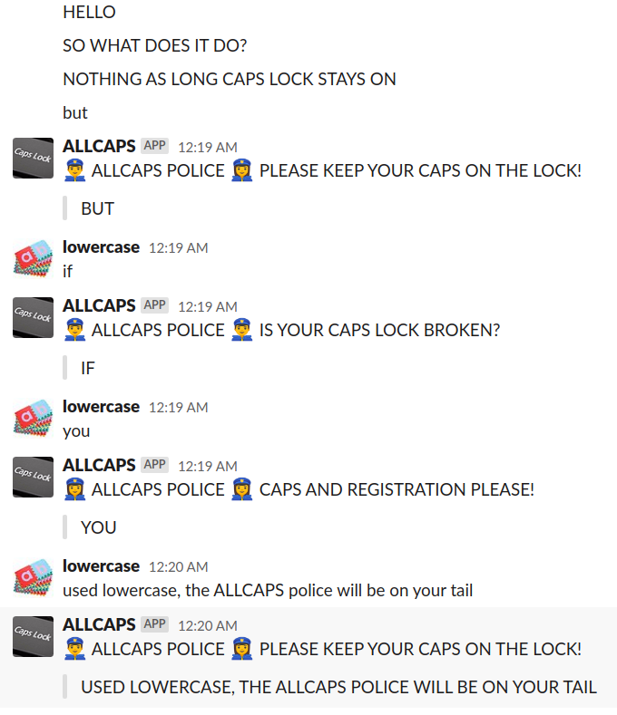

# A SLACK BOT TO MAKE YOU GO ALL CAPS

INVITE IT TO A CHANNEL AND SEE HOW IT WILL NOT ALLOW YOU TO USE ANYTHING BUT UPPERCASE!

# PREREQUISITES

REASONABLE RECENT VERSION OF GO. I USED GO MODULES.

## SLACK TOKEN

USED [THIS GUIDE](https://github.com/threatsimple/smug-broker/blob/master/doc/slack.md)
TO OBTAIN A SLACK TOKEN AND GET THE "APP" INSTALLED.

## GOLANG SLACK LIBRARY

HAD TO RUN THE FOLLOWING TO MAKE THE SLACK LIBRARY PLAY NICE
(CURRENT VERSION PICKED UP BY GO CONTAINS [THIS BUG](https://github.com/nlopes/slack/pull/618)):

```bash
go get github.com/nlopes/slack@d06c2a2b3249b44a9c5dee8485f5a87497beb9ea
```

## RUN

```bash
SLACKTOKEN=YOURTOKENHERE go run main.go
```

## AS A SYSTEMD SERVICE

SEE [ALLCAPS.SERVICE](allcaps.service) SYSTEMD SERVICE DEFINITION.

TO INSTALL (TESTED ON UBUNTU 16.04):

1. `adduser allcaps`
2. COPY `allcaps` BINARY TO `/home/allcaps`
3. PLACE SYSTEMD SERVICE SCRIPT IN `/lib/systemd/system/`
4. `sudo systemctl enable allcaps.service`
5. `sudo systemctl start allcaps`
6. `sudo journalctl -f -u allcaps`

THE LAST COMMAND WILL SHOW IF THE SERVICE WAS STARTED.

## IN ACTION


